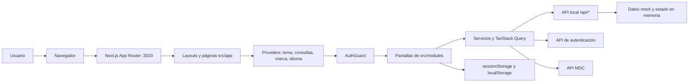
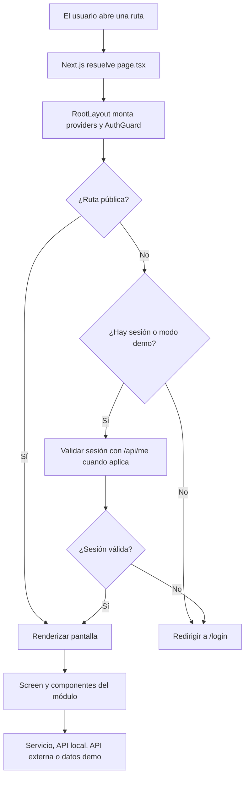
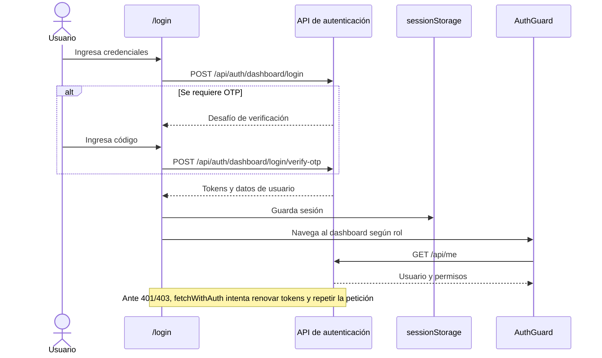
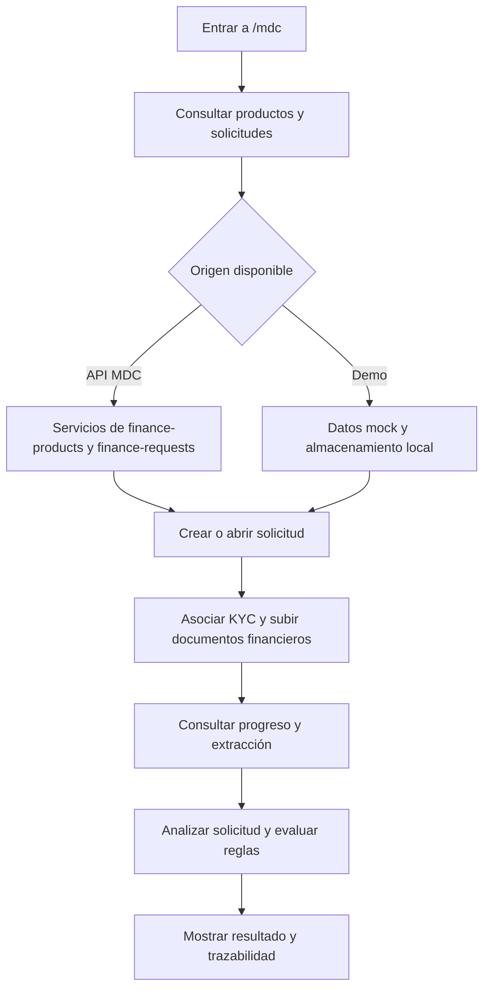
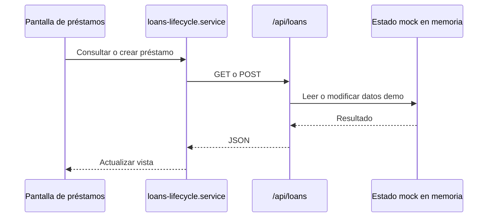

# Investark MDC Dashboard

Aplicación web de Zelify para clientes, crédito, depósitos, KYB, LIM, CRM, contabilidad y configuración. El paquete se llama `zelify-core`, pero este repositorio implementa principalmente una interfaz **Next.js 16 / React 19**, con rutas API locales de apoyo y conexiones desde el navegador a servicios externos.

## Inicio rápido

**Requisitos:** Node.js 20 y npm 10 o superior.

```bash
npm ci
```

Configura en `.env.local` las URLs de los servicios que vayas a usar:

```dotenv
NEXT_PUBLIC_AUTH_API_URL=http://localhost:8080
NEXT_PUBLIC_MDC_API_URL=http://localhost:3000
```

`NEXT_PUBLIC_AUTH_API_URL` debe ser una URL absoluta para el login y la sesión. `NEXT_PUBLIC_MDC_API_URL` apunta al backend MDC; si falta, el cliente MDC usa `http://127.0.0.1:3000`. Las variables `NEXT_PUBLIC_*` se incorporan al bundle durante la compilación: reinicia el servidor tras cambiarlas.

```bash
npm run dev
```

Abre `http://localhost:3020`. La comprobación de salud de **esta aplicación** es `GET http://localhost:3020/api/health`.

## Arquitectura



El `RootLayout` carga Tamagui, TanStack Query, branding, traducciones y `AuthGuard`. Las páginas de `src/app` componen pantallas de `src/modules`; las integraciones viven en sus servicios o en `src/lib`. El guard de rutas corre en el cliente. Las rutas API locales tienen su propia implementación y no representan un backend bancario persistente.

### Flujo de navegación



## Flujos principales

### Inicio de sesión y renovación



Los tokens se guardan en `sessionStorage`. Hay un modo de demostración separado que omite la validación remota.

### Solicitudes de crédito en MDC



El diagrama resume las capacidades presentes en `src/modules/mdc`; cada operación depende del estado de la solicitud y de la disponibilidad de las APIs configuradas.

### API local de demostración



El estado de préstamos se inicializa con datos de ejemplo y permanece en la memoria del proceso. Otras rutas, como clientes y depósitos, también usan respuestas mock; algunas escrituras solo devuelven una respuesta de éxito. No se debe asumir persistencia entre reinicios o instancias.

## Rutas y módulos

| Área | Rutas principales | Código funcional |
| --- | --- | --- |
| Inicio y acceso | `/`, `/login`, `/register` | `src/components/home-screen.tsx`, `src/lib/auth-api.ts` |
| MDC y crédito | `/mdc`, `/mdc/applications/[id]`, `/mdc/products/*`, `/mdc/rules/form` | `src/modules/mdc` |
| Clientes y grupos | `/customers`, `/customers/[customerId]`, `/groups` | `src/modules/customers`, `src/modules/groups` |
| Préstamos y depósitos | `/loan-transactions`, `/deposits`, `/deposit-transactions` | `src/modules/loans`, `src/modules/deposits` |
| Cumplimiento y liquidez | `/kyb/*`, `/lim`, `/lcc` | `src/modules/kyb`, `src/modules/lim`, `src/modules/scotia` |
| Operación y administración | `/crm/*`, `/accounting/*`, `/settings/*`, `/reporting` | Módulos homónimos en `src/modules` |

`/dashboard` redirige a `/`. El listado completo de rutas se encuentra en `src/app`.

## Datos e integraciones

| Componente | Destino o almacenamiento | Alcance actual |
| --- | --- | --- |
| Autenticación | `NEXT_PUBLIC_AUTH_API_URL` | Login, OTP, refresh, usuario, organización y permisos mediante la API externa. |
| MDC | `NEXT_PUBLIC_MDC_API_URL` | Productos, solicitudes, documentos, reglas y trazabilidad mediante la API externa; varias vistas admiten datos demo. |
| API local de Next.js | `/api/*` | Rutas de clientes, préstamos, depósitos, productos, grupos, sucursales, actividades y salud; predominan mocks. |
| Sesión y demos | `sessionStorage`, `localStorage` | Sesión del navegador y estados locales de demostración; no sustituyen una base de datos. |

Las llamadas del navegador a las APIs externas requieren que esos servicios sean accesibles desde el navegador y permitan el origen de la aplicación. Este repositorio no implementa conexiones directas a PostgreSQL, Kafka o S3; las referencias a esos sistemas en el README anterior no describían el código actual.

## Estructura del proyecto

```text
src/
  app/          Rutas, layouts y handlers /api de Next.js
  modules/      Pantallas, componentes, servicios, hooks y datos por dominio
  components/   UI reutilizable, navegación y componentes compartidos
  providers/    TanStack Query, Tamagui, branding e idioma
  lib/          Autenticación, caché, almacenamiento demo y utilidades
  config/       Navegación y configuración de vistas
  i18n/         Traducciones español/inglés
  styles/       Estilos globales y Tailwind
public/         Fuentes e imágenes estáticas
scripts/        Generación de PDF y preparación de demo
docs/           Guías y manuales del producto
```

Para convenciones de carpetas e imports, consulta [ARCHITECTURE.md](ARCHITECTURE.md). Ese archivo describe también una estructura objetivo; para conocer la implementación vigente, toma `src/` como referencia.

## Comandos y despliegue

| Comando | Uso |
| --- | --- |
| `npm run dev` | Desarrollo con Webpack en el puerto 3020. |
| `npm run dev:turbo` | Desarrollo con Turbopack en el puerto 3020. |
| `npm run lint` | Ejecuta ESLint. |
| `npm run build` | Genera CSS de Tamagui y compila Next.js. |
| `npm run start` | Sirve la compilación en el puerto 3020. |
| `npm run seed:mdc-demo` | Prepara datos de demostración de MDC. |

El `Dockerfile` genera una salida `standalone` y expone el puerto 3020. Acepta `NEXT_PUBLIC_AUTH_API_URL` y `NEXT_PUBLIC_MDC_API_URL` como argumentos de compilación. `docker-compose.yml` usa un archivo `.env`, pero actualmente no transmite esos argumentos al build; hay que configurarlos al construir la imagen si se necesitan las APIs externas. En Vercel se utiliza la salida nativa de Next.js. Actualmente `next.config.ts` tiene `typescript.ignoreBuildErrors: true`, así que una compilación exitosa no equivale a una validación de tipos completa.

## Documentación adicional

- [Guía de arquitectura y convenciones](ARCHITECTURE.md)
- [Guía del mock de core Mambu](MAMBU_CORE_MOCK_GUIDE.md)
- [Módulo LIM y exposición de Cortex](MODULO-LIM-CORTEX-EXPOSICION.md)
- [Guion de exposición Scotiabank](docs/guion-exposicion-scotiabank.md)
- [Manuales del producto](docs/manuales/)
