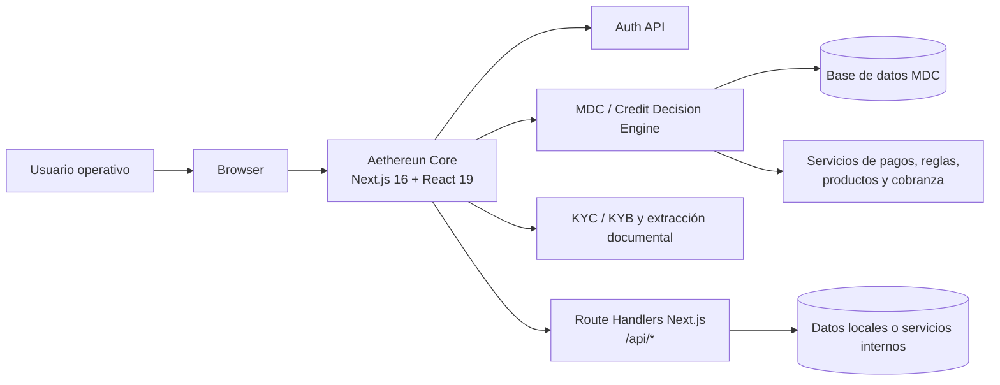
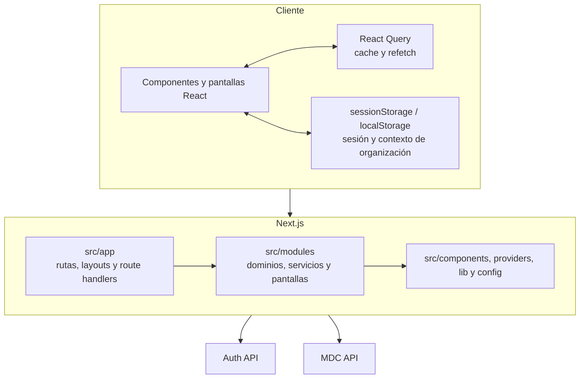
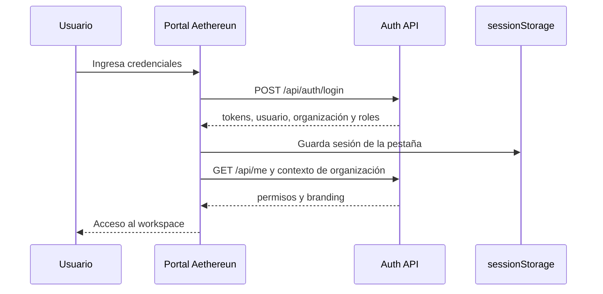
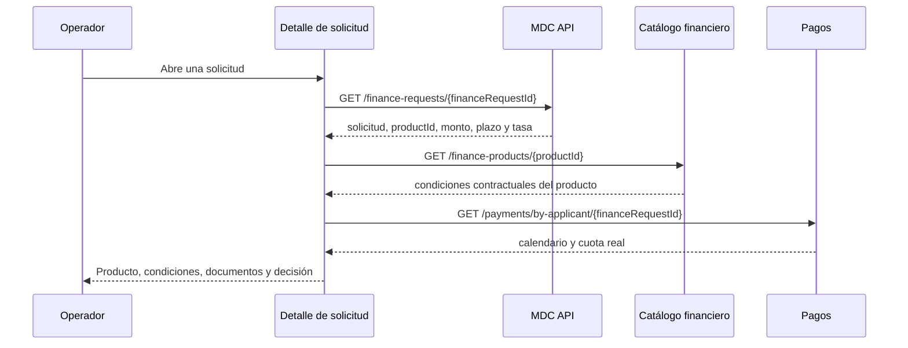
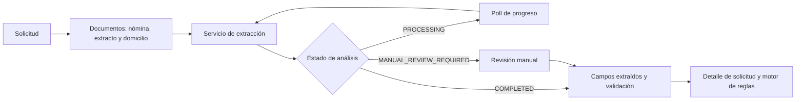
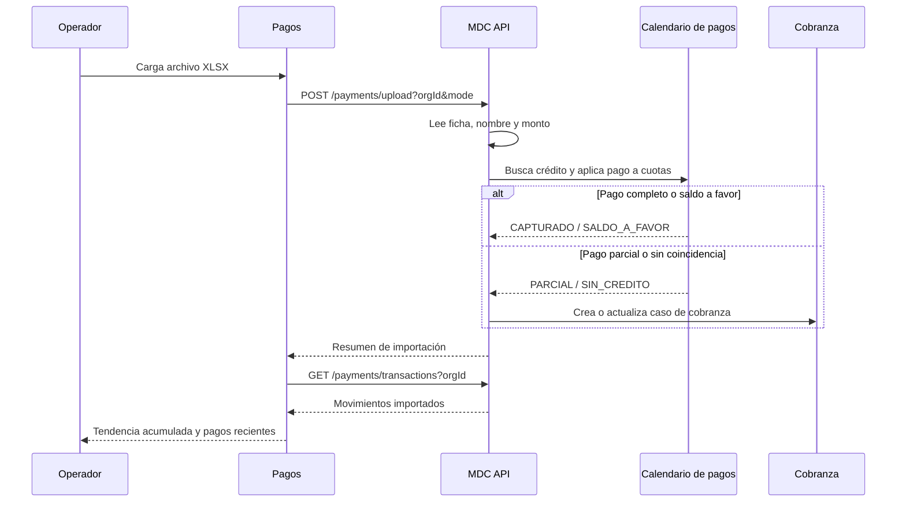
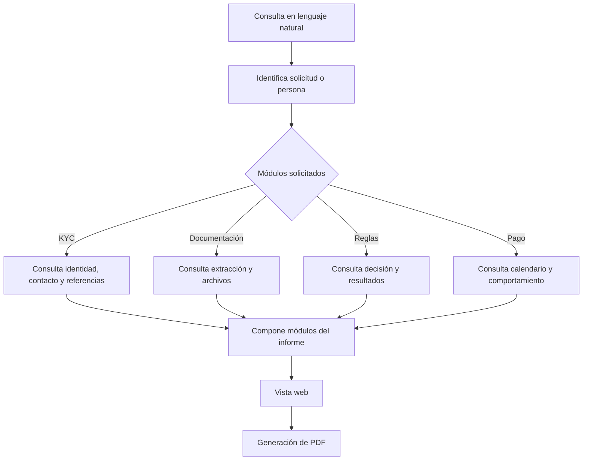

# Aethereun Core

Portal operativo para gestión financiera, originación de crédito, KYC/KYB, decisiones MDC, pagos, cobranza e informes. Es una aplicación web Next.js que compone la experiencia del usuario y consume los servicios de autenticación y motor de decisión.

## Contenido

- [Arquitectura](#arquitectura)
- [Módulos](#módulos)
- [Flujos operativos](#flujos-operativos)
- [Rutas y APIs](#rutas-y-apis)
- [Estructura del proyecto](#estructura-del-proyecto)
- [Configuración local](#configuración-local)
- [Comandos](#comandos)
- [Despliegue](#despliegue)

## Arquitectura

### Vista de contexto



### Capas de la aplicación



### Principios de integración

- La sesión, organización activa y roles se obtienen desde `NEXT_PUBLIC_AUTH_API_URL`.
- Los recursos de crédito se consultan desde `NEXT_PUBLIC_MDC_API_URL`.
- Los recursos PLD/AML se consultan desde `NEXT_PUBLIC_AML_API_URL`.
- `customFetch` agrega `x-org-id` y `x-user-name` a las solicitudes MDC cuando el contexto existe en el navegador.
- React Query administra consultas, invalidaciones y refetch de datos del detalle de solicitud.
- Las rutas `src/app/api/*` cubren salud y capacidades locales del portal; no sustituyen al motor MDC.
- No se deben incluir secretos, tokens ni URLs privadas en código fuente o documentación.

## Módulos

| Área | Responsabilidad principal |
| --- | --- |
| Dashboard | Indicadores, tareas y actividad reciente. |
| Clientes y grupos | Consulta y administración de clientes, grupos y relaciones. |
| Productos | Catálogo y configuración de productos financieros. |
| Depósitos, préstamos y contabilidad | Ciclos de vida, transacciones, precios, libro diario y balances. |
| KYB y AML | Onboarding empresarial, beneficiarios, listas y análisis PLD/AML. |
| MDC | Solicitudes, productos financieros, reglas, documentos, pagos, cobranza y manual de usuario. |
| Informes | Consultas en lenguaje natural, KYC, documentación, reglas y generación de PDF. |
| Configuración | Organización, usuarios, formularios, campos, webhooks, plantillas e integraciones. |

## Flujos operativos

### Inicio de sesión y contexto de organización



### Consulta de detalle de solicitud MDC



La sección **Producto y condiciones** usa el monto solicitado de la solicitud. El nombre, tasa, plazo, esquema y tipo de contrato se resuelven con el producto financiero. La cuota se toma de la primera cuota disponible en el calendario de pagos; mientras carga se muestra un indicador y, si no existe calendario, se muestra `No disponible`.

### Ejecución de reglas y decisión

```mermaid
flowchart TD
  A[Operador abre solicitud] --> B[Consulta reglas del usuario]
  B --> C[Selecciona Ejecutar reglas]
  C --> D[POST /decision-rules/{ruleId}/evaluate]
  D --> E[Motor evalúa nóminas, DTI y condiciones]
  E --> F[Persistencia de resultado y risk index]
  F --> G[Respuesta: decisión, reasons y rulesBreakdown]
  G --> H[UI actualiza estado general y desglose]
```

Estados habituales: `Aprobado`, `Revision` y `Rechazado`. Cuando una regla no aprueba, la interfaz utiliza `reasons` y `rulesBreakdown.reason` para explicar el resultado.

### Documentación y validación



### Importación y conciliación de pagos



La gráfica de tendencia utiliza los movimientos importados conciliados (`CAPTURADO`, `PARCIAL` y `SALDO_A_FAVOR`) y los acumula en el rango de 7, 30 o 90 días.

### Informes crediticios



## Rutas y APIs

### Rutas del portal

| Ruta | Uso |
| --- | --- |
| `/` | Inicio público. |
| `/login`, `/register` | Autenticación y registro. |
| `/dashboard` | Panel operativo. |
| `/customers`, `/groups` | Clientes y agrupaciones. |
| `/products` | Productos financieros. |
| `/deposits`, `/loan-transactions`, `/accounting/*` | Operación financiera y contabilidad. |
| `/kyb/*` | Onboarding y análisis empresarial. |
| `/mdc` | Motor de decisión de crédito. |
| `/mdc/applications/{id}` | Detalle de una solicitud. |
| `/mdc/manual` | Manual de usuario MDC. |
| `/reporting`, `/reports` | Informes y reportes. |
| `/aml-analisis`, `/conciliacion-dispersion` | Vistas estáticas de análisis y conciliación. |
| `/api/health` | Health check del contenedor. |

### Servicios MDC relevantes

| Recurso | Endpoint | Uso en la interfaz |
| --- | --- | --- |
| Solicitudes | `GET /finance-requests?orgId&personType` | Listado de solicitudes. |
| Detalle de solicitud | `GET /finance-requests/{id}` | Datos de la solicitud y `productId`. |
| Producto financiero | `GET /finance-products/{productId}` | Condiciones contractuales del producto. |
| Reglas | `GET /decision-rules?mode&orgId` | Catálogo de reglas activas. |
| Evaluación | `POST /decision-rules/{ruleId}/evaluate` | Decisión, razones, DTI y riesgo. |
| Resultado por usuario | `GET /user-rules?orgId&userId` | Estado de reglas ya ejecutadas. |
| Calendario | `GET /payments/by-applicant/{financeRequestId}` | Cuotas, intereses y saldo. |
| Importación | `POST /payments/upload?orgId&mode` | Conciliación de archivo XLSX. |
| Transacciones importadas | `GET /payments/transactions?orgId` | Tendencia acumulada de pagos. |

## Estructura del proyecto

```text
src/
├── app/                         # Rutas, layouts y route handlers de Next.js
│   ├── (public)/                # Inicio público
│   ├── (workspace)/             # Vistas operativas protegidas
│   ├── api/                     # APIs locales y health check
│   ├── login/ y register/       # Autenticación
│   └── mdc/, reporting/, ...
├── modules/                     # Capacidades de negocio
│   ├── mdc/                     # Motor de decisión de crédito
│   ├── reporting/               # Informes y PDF
│   ├── kyb/                     # Onboarding empresarial y AML
│   ├── accounting/, deposits/, loans/
│   ├── products/, customers/, organizations/
│   └── dashboard/, settings/, ...
├── components/                  # UI compartida, guards, navegación y upload
├── providers/                   # React Query, Tamagui, branding e i18n
├── lib/                         # Auth, caché, utilidades y estado de demo
├── config/                      # Navegación y configuración de workspace
├── styles/                      # Estilos globales
└── types/                       # Tipos compartidos

public/                          # Activos estáticos, manuales y fuentes
scripts/                         # Seed de demo y generación de PDF
docs/                            # Manuales y documentación de apoyo
```

### Convenciones

- `src/app`: routing y composición; evita ubicar lógica de dominio aquí.
- `src/modules/<dominio>`: pantallas, componentes, tipos, datos y servicios de una capacidad.
- `src/modules/<dominio>/services`: clientes HTTP y lógica de integración.
- `src/components`: piezas reutilizables que no pertenecen a un dominio específico.
- `src/lib`: infraestructura transversal, autenticación, almacenamiento y utilidades.
- La fuente oficial es **Nata Sans**, cargada localmente desde `public/fonts/Nata_Sans`.

## Configuración local

### Requisitos

- Node.js `20.9` o superior.
- npm `10` o superior.
- Acceso a Auth API y MDC API para datos reales.

### Variables de entorno

Crea `.env` en la raíz:

```dotenv
NEXT_PUBLIC_AUTH_API_URL=https://auth-api.example.com
NEXT_PUBLIC_MDC_API_URL=https://mdc-api.example.com
NEXT_PUBLIC_AML_API_URL=https://aml-api.example.com

# Solo para desarrollo o QA cuando aplique.
NEXT_PUBLIC_FORCE_ONBOARDING_VERIFIED=false
```

`NEXT_PUBLIC_*` se incorpora durante el build de Next.js. Reinicia el servidor de desarrollo después de modificar `.env`.

### Instalación y arranque

```bash
npm ci
npm run dev
```

El portal queda disponible en `http://localhost:3020`.

Comprueba la salud:

```bash
curl http://localhost:3020/api/health
```

Respuesta esperada:

```json
{
  "ok": true,
  "service": "zelify-core",
  "ts": "2026-01-01T00:00:00.000Z"
}
```

## Comandos

| Comando | Descripción |
| --- | --- |
| `npm run dev` | Desarrollo con webpack en puerto `3020`. |
| `npm run dev:turbo` | Desarrollo con Turbopack. |
| `npm run dev:with-css` | Genera CSS de Tamagui y levanta desarrollo. |
| `npm run tamagui:css` | Regenera `public/tamagui.generated.css`. |
| `npm run lint` | Ejecuta ESLint. |
| `npm run build` | Genera CSS y build standalone de producción. |
| `npm run start` | Sirve el build en puerto `3020`. |
| `npm run seed:mdc-demo` | Carga datos demo MDC. |
| `npm run generate:brief-pm` | Genera el brief PDF de persona moral. |

## Despliegue

La imagen Docker usa build multi-stage y salida `standalone` de Next.js.

```bash
docker build \
  --build-arg NEXT_PUBLIC_AUTH_API_URL=https://auth-api.example.com \
  --build-arg NEXT_PUBLIC_MDC_API_URL=https://mdc-api.example.com \
  --build-arg NEXT_PUBLIC_AML_API_URL=https://aml-api.example.com \
  -t aethereun-core .

docker run --rm -p 3020:3020 aethereun-core
```

También se puede usar Compose:

```bash
docker compose up --build
```

El contenedor expone el puerto `3020` y debe monitorearse mediante `GET /api/health`.

## Documentación relacionada

- [Arquitectura de carpetas](ARCHITECTURE.md)
- [Manual de usuario MDC](docs/manuales/mdc-usuario/Manual_Usuario_MDC_Testafin.pdf)
- [Manual de pagos y cobranza](docs/manuales/pagos-y-cobranza/README.md)
- [Guion de exposición](docs/guion-exposicion-scotiabank.md)
